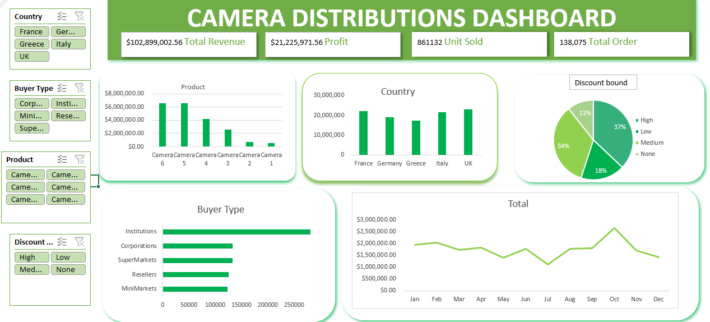

# 📊 Camera Sales Performance Analysis

## 📖 Project Overview

This project showcases an end-to-end sales analysis of a camera distribution company using Microsoft Excel. The objective was to transform raw sales data into meaningful business insights through data cleaning, PivotTables, PivotCharts, and an interactive dashboard.

The analysis explores camera sales across selected European countries, helping identify top-performing products, countries, buyer segments, and discount trends.

---

## 🎯 Business Questions

This project answers the following questions:

- What is the total revenue generated?
- What is the total profit earned?
- How many units were sold?
- Which country generated the highest revenue?
- Which buyer type purchased the most units?
- Which product generated the highest sales?
- How did discount bands affect sales?

---

## 🛠️ Tools Used

- Microsoft Excel
- PivotTables
- PivotCharts
- Slicers
- Dashboard Design

---

## 📸 Dashboard Preview

---

## 📈 Key Insights

- **Total Revenue:** €102,899,002.56
- **Total Profit:** €21,225,971.56
- **Units Sold:** 86,132
- **Total Orders:** 138,075
- France generated the highest revenue.
- Institutional buyers purchased the highest number of units.
- Medium discount bands contributed significantly to overall sales.

---

## 📂 Project Files

- `camera-sales-analysis.xlsx` — Excel workbook containing the cleaned data, PivotTables, dashboard, and analysis.
- `dashboard.png` — Screenshot of the interactive dashboard.

---

## 💡 Skills Demonstrated

- Data Cleaning
- Data Analysis
- PivotTables
- PivotCharts
- Dashboard Design
- Data Visualization
- Business Reporting

---

## 👩🏽‍💻 About Me

I'm **Amaka**, a Mathematics graduate building a career in Data Analytics. I enjoy transforming raw data into meaningful insights through Excel dashboards and business analysis, and I'm continuously expanding my skills in SQL, Power BI, and Python.
